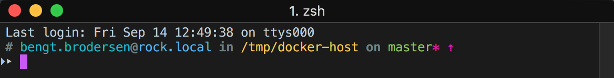

# zsh-theme-qoomon

## Screenshot

## Features
* Display username 
  * Username turns **red** if `root`
* Display host 
* Display current directory `$PWD`
  * Home directory `$HOME` is displayed as `~`
* Display git infos
  * Branch
  * Dirty flag `*` 
  * Indicator if your local repository is ahead `⇡` or behind origin `⇣`
  
* Print exit code, even if you only interrupt the comandline

## Color Schemes
* [iterm2 - qoomon.itermcolors](qoomon.itermcolors)
* [terminal - qoomon.itermcolors](qoomon.terminal)

## Font
[Andale Mono.ttf](Andale%20Mono.ttf)
